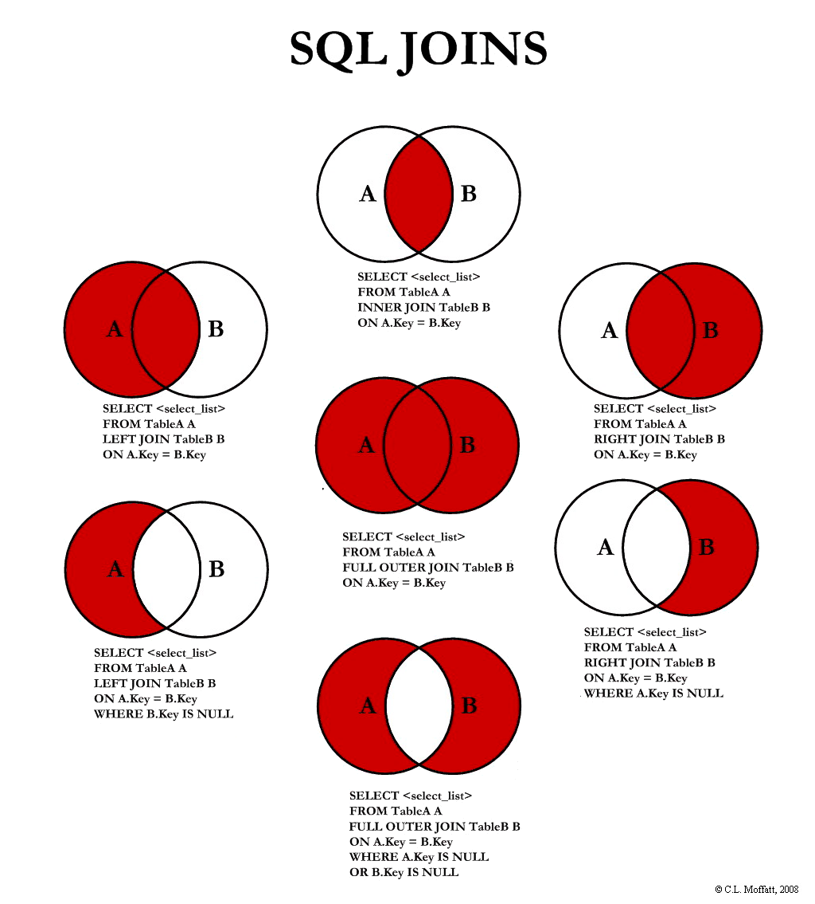

# The Complete SQL CheatSheet

## Definitions

**SQL** Structured Query Language: A language for querying and manipulating data.

**DDL** Data Definition Language: Create and modify structures in the database (tables, views, indexes, etc.)

**DML** Data Manipulation Language: SELECT, INSERT, UPDATE, DELETE etc. Used to store, modify, retrieve, delete and update data in database.

**DCL** Data Control Language: Rights, permissions and other controls of the database system.

**Data** The information that is stored in the database.

**Database** A collection of data.

**Schema** The structure of the database. The tables, views, indexes, etc.

**Table** A collection of data organized in rows and columns.

**Row** A single record in a table.

**Column** A single field in a table.

**Primary Key** A unique identifier for a row in a table.

**Foreign Key** A field in a table that is a primary key in another table.

**View** A virtual table that is the result of a query.

**Index** A data structure that improves the speed of data retrieval.

**Query** A request for data or information from a database table or combination of tables.

**Query Language** A language for requesting information from a database.

**Postgres** A relational database management system.

**Database Client** A program that allows you to connect to a Postgres database and run queries.

**Database Server** A program that runs on a computer and manages the database.

**Database Management System** A program that manages the database.

**Database Administrator** A person who manages the database.

**Database Developer** A person who creates and maintains the database.

**Database User** A person who uses the database.


## Datatypes

A Data type is a classification that defines the type, range of values, allowable operations on the values, and the meaning of the data values.

For a reference to the data types allowable in postgres, see the [Postgres documentation](https://www.postgresql.org/docs/current/datatype.html).

## Querying Data

### SELECT

The SELECT statement is used to query the database. It is the most common command in SQL.

```sql 
SELECT column1, column2, ...
FROM table_name;
```

### WHERE

The WHERE clause is used to filter records.

```sql
SELECT column1, column2, ...
FROM table_name
WHERE condition;
```

### AND & OR

The AND and OR operators are used to filter records based on more than one condition.

```sql
SELECT column1, column2, ...
FROM table_name
WHERE condition1 AND condition2 AND ...;
```

```sql
SELECT column1, column2, ...
FROM table_name
WHERE condition1 OR condition2 OR ...;
```

### ORDER BY

The ORDER BY clause is used to sort the result-set in ascending or descending order.

```sql
SELECT column1, column2, ...
FROM table_name
ORDER BY column1, column2, ... ASC|DESC;
```

### NULL CHECKING

The NULL value is a special value that indicates that a value is missing.

```sql
SELECT column1, column2, ...
FROM table_name
WHERE column IS NULL;
```

### DISTINCT

The DISTINCT keyword is used to return only distinct (different) values.

```sql
SELECT DISTINCT column1, column2, ...
FROM table_name;
```

### DATE

The DATE data type is used to store a date (year, month, day).

```sql
SELECT column1, column2, ...
FROM table_name
WHERE column = DATE '2008-08-08';
```

### BETWEEN

The BETWEEN operator is used to filter the result-set within a certain range.

```sql
SELECT column1, column2, ...
FROM table_name
WHERE column BETWEEN value1 AND value2;
```

### LIKE

The LIKE operator is used in a WHERE clause to search for a specified pattern in a column.

```sql
SELECT column1, column2, ...
FROM table_name
WHERE column LIKE pattern;
```

### IN

The IN operator allows you to specify multiple values in a WHERE clause.

```sql
SELECT column1, column2, ...
FROM table_name
WHERE column IN (value1, value2, ...);
```

### ALIAS

An alias is a temporary name given to a table or a column.

```sql
SELECT column1 AS alias1, column2 AS alias2, ...
FROM table_name AS alias3;
```

## Querying Multiple Tables

### JOIN


The JOIN clause is used to combine rows from two or more tables, based on a related column between them.

```sql
SELECT column_name(s)
FROM table1
INNER JOIN table2
ON table1.column_name = table2.column_name;
```

### LEFT JOIN

The LEFT JOIN clause returns all records from the left table (table1), and the matched records from the right table (table2). 
The result is NULL from the right side, if there is no match.

```sql
SELECT column_name(s)
FROM table1 
LEFT JOIN table2
ON table1.column_name = table2.column_name;
```

### RIGHT JOIN

The RIGHT JOIN clause returns all records from the right table (table2), and the matched records from the left table (table1). 
The result is NULL from the left side, when there is no match.

```sql
SELECT column_name(s)
FROM table1
RIGHT JOIN table2
ON table1.column_name = table2.column_name;
```

### FULL JOIN

The FULL JOIN clause returns all records when there is a match in either left (table1) or right (table2) table records.

```sql
SELECT column_name(s)
FROM table1
FULL JOIN table2
ON table1.column_name = table2.column_name;
```

### FULL OUTER JOIN

The FULL OUTER JOIN keyword returns all records when there is a match in left (table1) or right (table2) table records.

```sql
SELECT column_name(s)
FROM table1
FULL OUTER JOIN table2 ON table1.column_name = table2.column_name;
```

### FULL INNER JOIN

The FULL INNER JOIN keyword returns all records when there is a match in both left (table1) and right (table2) table records.

```sql
SELECT column_name(s)
FROM table1
FULL INNER JOIN table2 ON table1.column_name = table2.column_name;
```

### UNION

The UNION operator is used to combine the results of two or more SELECT statements.

```sql
SELECT column_name(s) FROM table1
UNION
SELECT column_name(s) FROM table2;
```

### INNER JOIN

The INNER JOIN keyword selects records that have matching values in both tables.

```sql 
SELECT column_name(s)
FROM table1
INNER JOIN table2 ON table1.column_name = table2.column_name;
```

## Grouping Data

### GROUP BY

The GROUP BY statement groups rows that have the same values into summary rows, like "find the number of citizens in each country".

```sql
SELECT column_name, aggregate_function(column_name)
FROM table_name
WHERE column_name operator value
GROUP BY column_name;
```

### HAVING

The HAVING clause was added to SQL because the WHERE keyword could not be used with aggregate functions.

```sql
SELECT column_name, aggregate_function(column_name)
FROM table_name
WHERE column_name operator value
GROUP BY column_name
HAVING aggregate_function(column_name) operator value;
```

## Aggregate Functions

### COUNT

The COUNT() function returns the number of rows that matches a specified criteria.

```sql
SELECT COUNT(column_name)
FROM table_name
WHERE condition;
```

### SUM

The SUM() function returns the total sum of a numeric column.

```sql
SELECT SUM(column_name)
FROM table_name
WHERE condition;
```

### AVG

The AVG() function returns the average value of a numeric column.

```sql
SELECT AVG(column_name)
FROM table_name
WHERE condition;
```

### MIN

The MIN() function returns the smallest value of the selected column.

```sql
SELECT MIN(column_name)
FROM table_name
WHERE condition;
```

### MAX

The MAX() function returns the largest value of the selected column.

```sql
SELECT MAX(column_name)
FROM table_name
WHERE condition;
```

## Subqueries

A subquery is a query within a query. The subquery is executed first, and the main query uses the result of the subquery.

```sql
SELECT column_name(s)
FROM table_name
WHERE column_name operator ANY
(SELECT column_name FROM table_name WHERE condition);
```

## Creating Tables

### CREATE TABLE

The CREATE TABLE statement is used to create a new table in a database.

```sql
CREATE TABLE table_name (
    column1 datatype,
    column2 datatype,
    column3 datatype,
   ....
);
```

### ALTER TABLE

The ALTER TABLE statement is used to add, delete, or modify columns in an existing table.

```sql
ALTER TABLE table_name
ADD column_name datatype;
```

```sql
ALTER TABLE table_name
DROP COLUMN column_name;
```

```sql
ALTER TABLE table_name
ALTER COLUMN column_name datatype;
```

### DROP TABLE

The DROP TABLE statement is used to delete a table.

```sql
DROP TABLE table_name;
```

## Inserting, Updating, and Deleting Data

### INSERT INTO

The INSERT INTO statement is used to insert new records in a table.

```sql
INSERT INTO table_name (column1, column2, column3, ...)
VALUES (value1, value2, value3, ...);
```

### UPDATE

The UPDATE statement is used to modify the existing records in a table.

```sql
UPDATE table_name
SET column1 = value1, column2 = value2, ...
WHERE condition;
```

### DELETE

The DELETE statement is used to delete existing records in a table.

```sql
DELETE FROM table_name WHERE condition;
```

## Creating and Deleting Databases

### CREATE DATABASE

The CREATE DATABASE statement is used to create a new database.

```sql
CREATE DATABASE database_name;
```

### DROP DATABASE

The DROP DATABASE statement is used to delete a database.

```sql
DROP DATABASE database_name;
```

## Creating and Deleting Indexes

### CREATE INDEX

The CREATE INDEX statement is used to create an index (search key) on a table.

```sql
CREATE INDEX index_name
ON table_name (column1, column2, ...);
```

### DROP INDEX

The DROP INDEX statement is used to delete an index.

```sql
DROP INDEX index_name ON table_name;
```

## Creating Views

A view is a virtual table based on the result-set of an SQL statement.

### CREATE VIEW

The CREATE VIEW statement is used to create a view.

```sql
CREATE VIEW view_name AS
SELECT column_name(s)
FROM table_name
WHERE condition;
```

### DROP VIEW

The DROP VIEW statement is used to delete a view.

```sql
DROP VIEW view_name;
```

## Case Statements

A CASE statement is used to search for one value and return another value.

```sql
SELECT column_name, CASE
    WHEN condition THEN 'Result1'
    WHEN condition THEN 'Result2'
    ELSE 'Result3'
END
FROM table_name;
```

## Conditional Statements

### IF

The IF statement is used to perform different actions based on different conditions.

```sql
IF condition THEN
    -- code to be executed if condition is true
ELSE
    -- code to be executed if condition is false
END IF;
```

### IFNULL

The IFNULL() function returns a replacement value if the original value is NULL.

```sql
SELECT IFNULL(column_name, 'value')
FROM table_name;
```

### COALESCE

The COALESCE() function returns the first non-NULL value in a list.

```sql
SELECT COALESCE(column_name, 'value')
FROM table_name;
```

## Comments

### Single Line Comments

Single line comments start with two dashes (--) and end at the end of the line.

```sql
-- This is a comment
```

### Multi Line Comments

Multi line comments start with a slash and an asterisk (/*) and end with an asterisk and a slash (*/).

```sql
/*
This is a comment
This is a comment
This is a comment
*/
```

## Wildcards

### LIKE

The LIKE operator is used in a WHERE clause to search for a specified pattern in a column.

```sql
SELECT column_name(s)
FROM table_name
WHERE column_name LIKE pattern;
```

### Wildcard Characters

| Character | Description |
| :--- | :--- |
| % | The percent sign represents zero, one, or multiple characters |
| _ | The underscore represents a single character |


